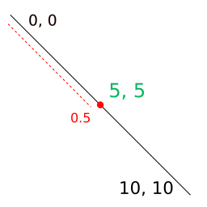

# 📦 polf

[![NPM version][npm-version-image]][npm-link]
[![License][license-image]][license-link]
[![NodeJS versions][npm-versions-image]][npm-link]

Find point coordinates inside line functions between a range `t` from 0 to 1.

## Status

[![Tests][tests-image]][tests-link]
[![Coverage status][coverage-image]][coverage-link]

## Installation

```
npm install polf
```

## Quickstart

```javascript
> const { lineXY } = require("polf");
> lineXY([0, 0], [10, 10], .5)
[ 5, 5 ]
```

<p align="center">
  
</p>

## Documentation

### Point on line functions [▼](https://github.com/mondeja/polf#point-on-line-functions)
- [lineXY](https://github.com/mondeja/polf/blob/master/README.md#lineXY)
- [cubicBezierXY](https://github.com/mondeja/polf/blob/master/README.md#cubicBezierXY)
- [quadraticBezierXY](https://github.com/mondeja/polf/blob/master/README.md#quadraticBezierXY)
- [ellipticalArcXY](https://github.com/mondeja/polf/blob/master/README.md#ellipticalArcXY)

### Utility functions [▼](https://github.com/mondeja/polf#utility-functions)
- [angleBetween](https://github.com/mondeja/polf/blob/master/README.md#angleBetween)

### Point on line functions

<a name="lineXY" href="#lineXY">#</a> <b>lineXY</b>(<i>p0</i>, <i>p1</i>, <i>t</i>) ⇒ `array`

Computes the coordinate of a point in a line parametrized in the range `t` from 0 to 1.

> Algorithm: `B(t) = p0 + (p1 - p0) * t , 0 <= t <= 1`

- **p0** (array) Start point coordinate.
- **p1** (array) End point coordinate.
- **t** (number) Number in the range from 0 to 1 that parametrizes the location on the line.

<a name="cubicBezierXY" href="#cubicBezierXY">#</a> <b>cubicBezierXY</b>(<i>p0</i>, <i>p1</i>, <i>p2</i>, <i>p3</i>, <i>t</i>) ⇒ `array`

Computes the coordinate of a point in a cubic Bézier curve parametrized in the range `t` from 0 to 1.

> Algorithm: `B(t) = (1-t)^3 * p0 + 3*(1-t)^2 * t * p1 + 3*(1-t)^2 * p2 + t^3 * p3 , 0 <= t <= 1`

- **p0** (array) Start point coordinate.
- **p1** (array) First control point coordinate.
- **p2** (array) Second control point coordinate.
- **p3** (array) End point coordinate.
- **t** (number) Number in the range from 0 to 1 that parametrizes the location on the curve.

<a name="quadraticBezierXY" href="#quadraticBezierXY">#</a> <b>quadraticBezierXY</b>(<i>p0</i>, <i>p1</i>, <i>p2</i>, <i>t</i>) ⇒ `array`

Computes the coordinate of a point in a quadratic Bézier curve parametrized in the range `t` from 0 to 1. 

> Algorithm: `B(t) = (1-t) * 2 * p0 + 2*(1-t)*t * p1 + t2 * p2 , 0 <= t <= 1`

- **p0** (array) Start point coordinate.
- **p1** (array) Coordinate of the control point.
- **p2** (array) End point coordinate.
- **t** (number) Number in the range from 0 to 1 that parametrizes the location on the curve.

<a name="ellipticalArcXY" href="#ellipticalArcXY">#</a> <b>ellipticalArcXY</b>(<i>p0</i>, <i>rx</i>, <i>ry</i>, <i>xAxisRotation</i>, <i>largeArc</i>, <i>sweep</i>, <i>p1</i>, <i>t</i>) ⇒ `array`

Computes the coordinate of a point in a elliptical arc parametrized in the range `t` from 0 to 1.

- **p0** (array) Start point coordinate.
- **rx** (number) X radius of the arc.
- **ry** (number) Y radius of the arc.
- **xAxisRotation** (number) Rotation in X of the arc in degrees.
- **largeArc** (boolean) `large-arc` flag that specifies how the arc is drawn.
- **sweep** (boolean) `sweep` flag that specifies how the arc is drawn.
- **p1** (array) End point coordinate.
- **t** (number) Number in the range from 0 to 1 that parametrizes the location on the arc.

### Utility functions

<a name="angleBetween" href="#angleBetween">#</a> <b>angleBetween</b>(<i>v0</i>, <i>v1</i>) ⇒ `number`

Computes the angle between two vectors.

- **v0** (array) First vector in comparison.
- **v1** (array) Second vector in comparison.

[npm-link]: https://www.npmjs.com/package/polf
[npm-version-image]: https://img.shields.io/npm/v/polf
[tests-image]: https://img.shields.io/github/workflow/status/mondeja/polf/Test
[tests-link]: https://github.com/mondeja/polf/actions?query=workflow%3ATest
[coverage-image]: https://coveralls.io/repos/github/mondeja/polf/badge.svg?branch=master
[coverage-link]: https://coveralls.io/github/mondeja/polf?branch=master
[license-image]: https://img.shields.io/npm/l/polf?color=brightgreen
[license-link]: https://github.com/mondeja/polf/blob/master/LICENSE
[npm-versions-image]: https://img.shields.io/node/v/polf
